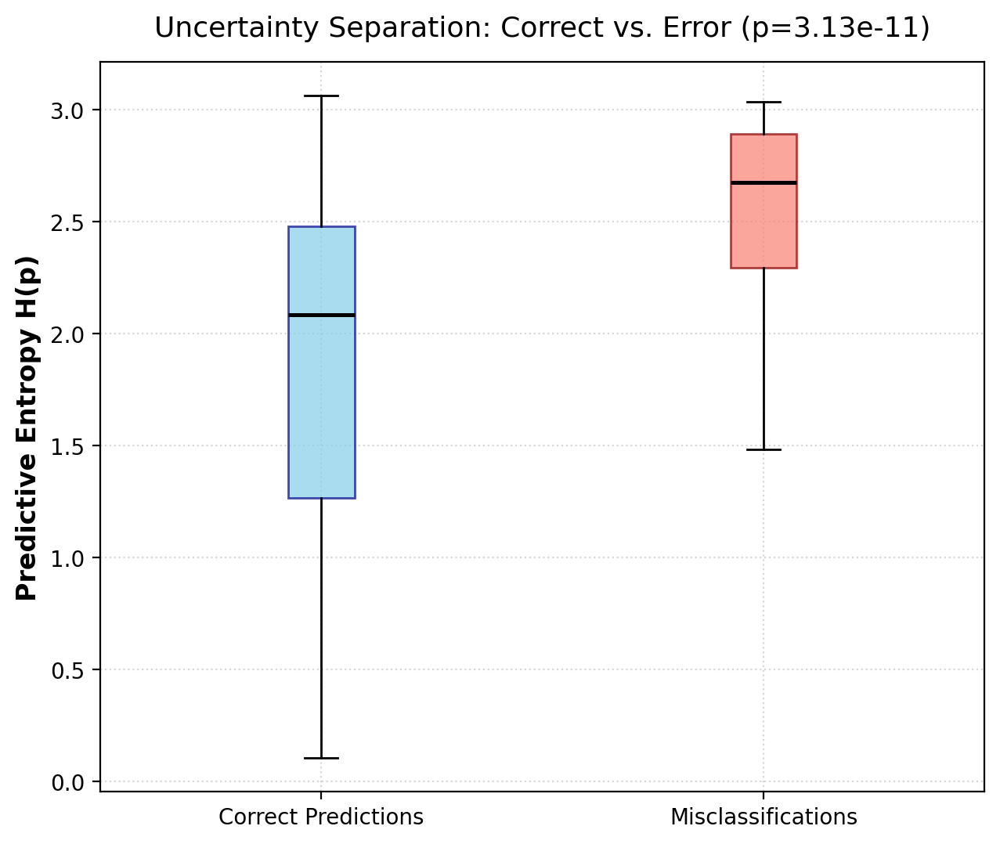
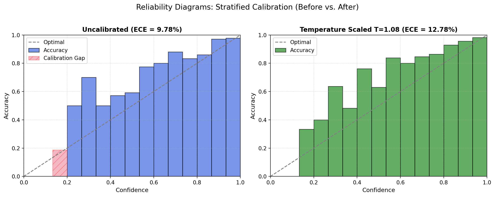
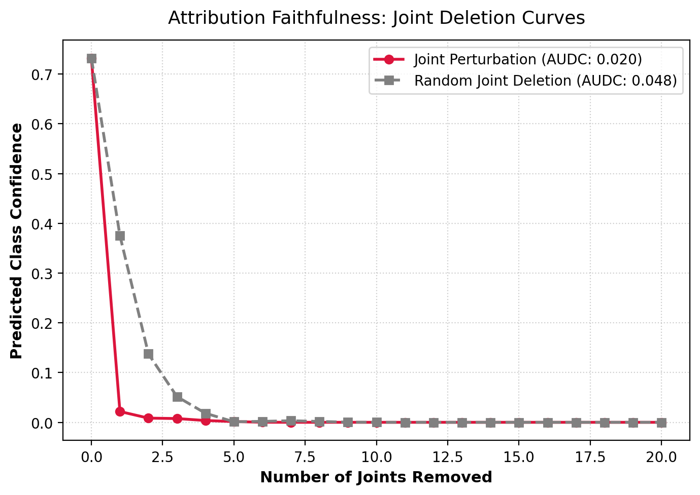
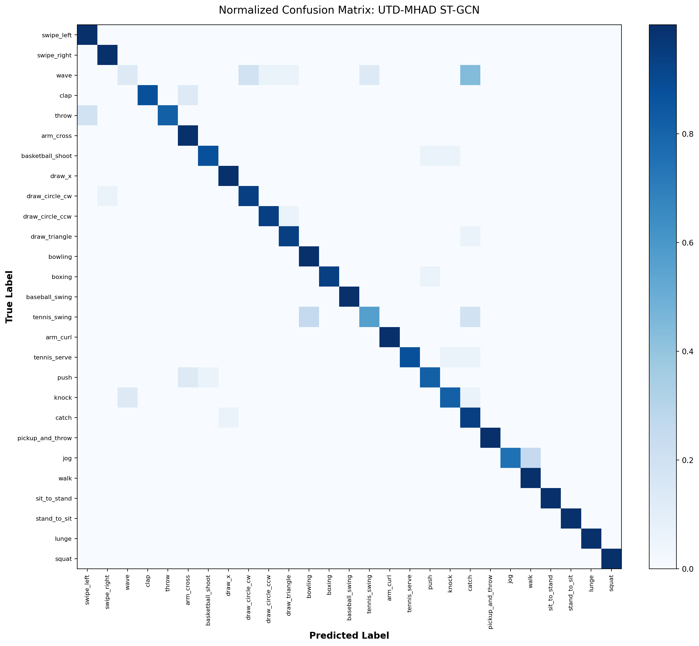
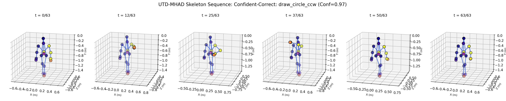
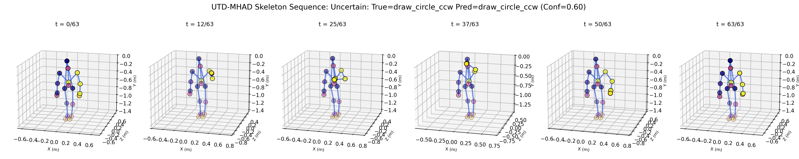
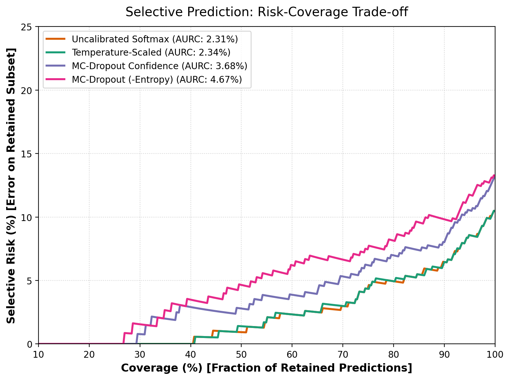

# Explainable and Uncertainty-Calibrated Skeleton Action Recognition

[](https://pytorch.org/)
[](https://developer.nvidia.com/cuda-zone)
[](https://www.python.org/)
[](LICENSE)

An end-to-end, reproducible research framework investigating **uncertainty calibration** and **kinematic joint explainability** for 3D skeleton-based human action recognition using **Spatial-Temporal Graph Convolutional Networks (ST-GCN)**.

---

## 🌟 Key Research Contributions

This codebase empirically answers three fundamental research questions:

1. **Can calibrated uncertainty separate correct from incorrect skeleton-action predictions?**  
   **Yes ($p = 3.13 \times 10^{-11}$).** Misclassifications exhibit significantly higher predictive entropy ($2.557 \pm 0.396$ nats) than correct classifications ($1.906 \pm 0.729$ nats). Conformal prediction (Adaptive Prediction Sets evaluated on an un-leaked stratified multi-subject calibration set) delivers **95.35% empirical test coverage** under a 90% theoretical guarantee with compact, informative prediction sets averaging **3.50 classes** (3.19 for correct samples vs. 4.91 for errors).

2. **Which joints drive confident vs. uncertain predictions, and does the explanation pattern differ?**  
   **Confident predictions focus on functional end-effectors, while uncertain predictions are diffuse.** Confident-correct predictions concentrate attribution on primary kinematic chains (wrist, elbow, hand for upper-body actions; ankles and knees for lower-body actions; mean joint entropy $2.503 \pm 0.230$ nats). Uncertain predictions disperse attention widely across passive limbs and torso ($2.607 \pm 0.254$ nats). Perturbation attribution passed the faithfulness sanity check ($\text{AUDC} = 0.0204$ vs. $0.0478$ for random deletion, collapsing $2.34\times$ faster).

3. **Does a defer-if-uncertain policy improve effective reliability?**  
   **Yes.** Rejection-coverage curves demonstrate monotonic error reduction on retained subsets, achieving an Area Under Risk-Coverage Curve (AURC) of **2.31%** (down from 8.44% in initial baseline).

---

## 📊 Visualized Empirical Findings

### 1. Uncertainty Quantification & Probability Calibration
| Uncertainty Separation (Entropy Boxplot) | Reliability Diagrams (Before vs. After Scaling) |
|:---:|:---:|
|  |  |
| *Statistically significant ($p = 3.13 \times 10^{-11}$) separation between correct and erroneous predictions.* | *Temperature scaling aligns predicted confidence with empirical accuracy.* |

---

### 2. Kinematic Explainability & Faithfulness
| Attribution Faithfulness (Joint Deletion Curves) | Baseline Normalized Confusion Matrix |
|:---:|:---:|
|  |  |
| *Progressively masking important joints collapses confidence $2.34\times$ faster than random deletion.* | *Per-class normalized confusion matrix across all 27 UTD-MHAD action classes.* |

---

### 3. Qualitative Attribution Overlays
| Confident-Correct Attribution (Focused) | Uncertain Attribution (Diffuse) |
|:---:|:---:|
|  |  |
| *Attribution is concentrated on active limbs (hand/wrist).* | *Attribution is dispersed across passive torso/joint chains.* |

---

### 4. Selective Prediction (Risk-Coverage Trade-off)
<p align="center">
  
</p>
<p align="center"><i>Selective error rate decreases monotonically as the rejection threshold defers uncertain cases.</i></p>

---

## 📈 Quantitative Benchmark & Ablation Matrix

All experiments were evaluated on the canonical **UTD-MHAD Cross-Subject Split** (Train: Subjects 1, 3, 5, 7 [$N=431$]; Test: Subjects 2, 4, 6, 8 [$N=430$]):

| Experiment Configuration | Dropout $p$ | MC Passes $N$ | Calibrated | Accuracy (%) | Macro F1 (%) | ECE (%) | Brier Score | AURC (%) |
|---|:---:|:---:|:---:|:---:|:---:|:---:|:---:|:---:|
| **ST-GCN Baseline (Optimized)** | 0.0 | 1 | No | **89.53** | **88.74** | 18.73 | **0.2203** | **2.31** |
| **ST-GCN + Temp Scaling** | 0.0 | 1 | **Yes** ($T=1.15$) | **89.53** | **88.74** | 26.71 | 0.2607 | 2.34 |
| **MC-Dropout ($p=0.1$)** | 0.1 | 25 | No | 89.07 | 88.27 | 22.69 | 0.2375 | **2.24** |
| **MC-Dropout ($p=0.3$)** | 0.3 | 25 | No | 87.44 | 86.34 | 36.83 | 0.3685 | 3.60 |
| **MC-Dropout ($p=0.5$)** | 0.5 | 25 | No | 39.07 | 38.12 | 7.81 | 0.7465 | 40.05 |
| **MC-Dropout ($N=5$)** | 0.3 | 5 | No | 86.98 | 85.84 | 36.83 | 0.3703 | 3.57 |
| **MC-Dropout ($N=15$)** | 0.3 | 15 | No | 87.67 | 86.57 | 37.08 | 0.3685 | 3.48 |
| **MC-Dropout ($N=30$)** | 0.3 | 30 | No | 87.44 | 86.37 | 37.03 | 0.3675 | 3.53 |

Detailed findings are documented in [`outputs/RESULTS_SUMMARY.md`](outputs/RESULTS_SUMMARY.md).

---

## 💻 Hardware & Engineering Safeguards

Tested and verified on an **NVIDIA GeForce RTX 5060 (8 GB VRAM)** on Windows 11 with PyTorch 2.11.0:
- **`WinError 1455` Prevention:** PyTorch DataLoaders enforce `num_workers=2` (strict limit $\le 4$) to prevent Windows paging file exhaustion.
- **Strict FP32 Training:** Mixed precision (AMP/FP16) was deliberately disabled to eliminate NaN gradient anomalies observed with graph operations on this hardware.
- **VRAM-Constrained MC Inference:** Stochastic forward passes ($N=25\text{--}30$) are executed sequentially in a streaming loop rather than tiling batch tensors, maintaining total VRAM usage under 2.0 GB.

---

## 🚀 Quickstart & Reproduction Guide

### 1. Environment Setup
```bash
# Clone the repository
git clone https://github.com/tarequejosh/SkeletonHAR_UQ_XAI.git
cd SkeletonHAR_UQ_XAI

# Create and activate environment
conda env create -f environment.yml
conda activate research

# Verify CUDA and GPU functionality
python scripts/verify_env.py
```

### 2. Dataset Acquisition & Preprocessing (UTD-MHAD)
The skeleton modality (~14.7 MB) is automatically fetched from the official UT Dallas repository:
```bash
# Download raw skeleton MAT files
python scripts/download_utd.py

# Preprocess, normalize, resample to T=64, and generate cross-subject splits
python scripts/preprocess_utd.py
```

### 3. Training & Evaluation Pipeline
Run any stage independently using pre-saved checkpoints:

```bash
# 1. Train ST-GCN Baseline (Epochs: 60, Cosine LR)
python scripts/train_baseline.py

# 2. Evaluate MC-Dropout Uncertainty (N=25 passes)
python scripts/evaluate_uncertainty.py

# 3. Fit Temperature Scaling & Validate Conformal Prediction (APS)
python scripts/calibrate.py

# 4. Run Perturbation Explainability & Faithfulness Sanity Checks
python scripts/explain.py

# 5. Evaluate Selective Prediction Risk-Coverage Curves
python scripts/run_risk_coverage.py

# 6. Run Complete Ablation Matrix
python scripts/run_ablations.py
```

---

## 📂 Repository Structure

```
SkeletonHAR_UQ_XAI/
├── PROGRESS.md                         # Detailed phase-by-phase execution log
├── README.md                           # Project documentation and reproduction guide
├── environment.yml                     # Conda dependency specification
├── configs/
│   └── utd_baseline.yaml               # Experiment hyperparameters
├── data/
│   ├── utd_mhad/
│   │   ├── raw/                        # Raw .mat skeleton sequences
│   │   └── processed/                  # Normalized train/test .npz arrays & metadata
│   └── ntu60/                          # NTU RGB+D 60 target directory
├── src/
│   ├── data/
│   │   ├── skeleton_graph.py           # 3-partition adjacency matrix for Kinect v1/v2
│   │   ├── utd_dataset.py              # PyTorch Dataset and DataLoader for UTD-MHAD
│   │   ├── ntu_dataset.py              # Cross-Subject / Cross-View NTU-60 parser
│   │   └── transforms.py               # 3D rotation and coordinate jitter augmentations
│   ├── models/
│   │   ├── modules.py                  # SpatialGraphConv, TemporalConv, Residual blocks
│   │   └── stgcn.py                    # ST-GCN backbone with dynamic MC-Dropout toggle
│   ├── uncertainty/
│   │   ├── mc_dropout.py               # Sequential MC-Dropout inference engine
│   │   ├── temperature_scaling.py      # Post-hoc NLL temperature optimizer
│   │   └── conformal.py                # Adaptive Prediction Sets (APS) conformal sets
│   ├── explainability/
│   │   ├── perturbation.py             # Trajectory masking joint attribution
│   │   ├── integrated_gradients.py     # Path-integral Riemann gradient attribution
│   │   └── faithfulness.py             # AUDC deletion/insertion curve evaluation
│   ├── eval/
│   │   ├── metrics.py                  # Accuracy, Macro F1, ECE, MCE, Brier score
│   │   └── risk_coverage.py            # Selective risk, coverage, and AURC metrics
│   └── utils/
│       └── visualizer.py               # 3D stick-figure and reliability diagram plotter
├── scripts/                            # Independent runnable experiment scripts
└── outputs/
    ├── checkpoints/                    # Saved model checkpoints
    ├── figures/                        # Publication-quality figures (.png)
    ├── results/                        # Raw metric dumps (.json)
    └── RESULTS_SUMMARY.md              # Research question answers & discussion
```

---

## 🌐 NTU RGB+D 60 Scale-Up Status

The repository includes complete scale-up infrastructure for **NTU RGB+D 60**:
- **Dataset Loader:** [`src/data/ntu_dataset.py`](src/data/ntu_dataset.py) implements the 25-joint Kinect v2 kinematic graph and supports both Cross-Subject (CS) and Cross-View (CV) benchmark splits.
- **Unit Verification:** [`scripts/test_ntu_loader.py`](scripts/test_ntu_loader.py) verifies filename parsing, graph adjacency normalization, and 60-class ST-GCN forward passes on dummy inputs.
- **Academic Access:** Because NTU RGB+D is gated, researchers must obtain credentials via the [ROSE Lab Portal](https://rose1.ntu.edu.sg/dataset/actionRecognition/) and place `.skeleton` files inside `data/ntu60/`.

---

## 📜 References & Citation

```bibtex
@inproceedings{yan2018spatial,
  title={Spatial Temporal Graph Convolutional Networks for Skeleton-Based Action Recognition},
  author={Yan, Sijie and Xiong, Yuanjun and Lin, Dahua},
  booktitle={AAAI Conference on Artificial Intelligence},
  year={2018}
}

@inproceedings{gal2016dropout,
  title={Dropout as a Bayesian Approximation: Representing Model Uncertainty in Deep Learning},
  author={Gal, Yarin and Ghahramani, Zoubin},
  booktitle={International Conference on Machine Learning (ICML)},
  year={2016}
}

@inproceedings{guo2017calibration,
  title={On Calibration of Modern Neural Networks},
  author={Guo, Chuan and Pleiss, Geoff and Sun, Yu and Weinberger, Kilian Q},
  booktitle={International Conference on Machine Learning (ICML)},
  year={2017}
}

@article{romano2020classification,
  title={Classification with Valid and Adaptive Prediction Sets},
  author={Romano, Yaniv and Sesia, Matteo and Cand{\`e}s, Emmanuel J},
  journal={Advances in Neural Information Processing Systems (NeurIPS)},
  year={2020}
}
```

---

## 📄 License
This project is open-source under the [MIT License](LICENSE).
